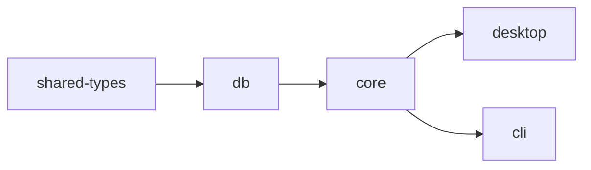

<div align="center">

# FreeCrawl SEO Tool

### Open-source desktop SEO crawler — a free, cross-platform alternative to Screaming Frog

[](LICENSE)
[](https://github.com/kemalai/FreeCrawl-SEO-Tool/releases)
[](https://github.com/kemalai/FreeCrawl-SEO-Tool/stargazers)
[](https://github.com/kemalai/FreeCrawl-SEO-Tool/commits/main)
[](#-quick-start)

**[🌐 Website](https://freecrawl.net/)** ·
**[📦 Download](https://github.com/kemalai/FreeCrawl-SEO-Tool/releases)** ·
**[🐛 Report Bug](https://github.com/kemalai/FreeCrawl-SEO-Tool/issues)** ·
**[📝 Changelog](CHANGELOG.md)**

<br />

A high-performance website crawler built for serious SEO audits. Targets <kbd>1M+ URLs</kbd> on a single machine, with a dense Screaming Frog–style UI, ~70 SEO issue checks, and zero native dependencies.

</div>

<br />

---

## ✨ Highlights

<table>
<tr>
<td width="50%" valign="top">

### 🚀 Crawler
- **undici** HTTP client with keep-alive Agent
- **80–150 URL/s** typical throughput
- **1M+ URL** crawls on a single machine
- robots.txt, sitemaps, redirect chains
- HTTP Basic / Bearer auth, proxy override
- Pause / Resume / manual URL injection

</td>
<td width="50%" valign="top">

### 🔍 Analysis
- **~70 SEO issue checks** across 14 tabs
- Near-duplicate clustering (SimHash + LSH)
- Full hreflang validation, sitemap diff
- OpenGraph / Twitter Card / JSON-LD / AMP
- SSL/TLS cert audit, security headers
- Custom CSS + Regex extraction (10 rules)

</td>
</tr>
<tr>
<td valign="top">

### 🖥 Desktop UI
- Dense dark theme, virtualized 1M+ row tables
- Live-streaming rows during crawl
- Advanced AND/OR search (24 fields × 12 ops)
- Detail panel with 9 sub-tabs per URL
- Cytoscape graph + anchor-text word cloud
- Diagnostic popups for DNS/TLS/proxy issues

</td>
<td valign="top">

### 📤 Export & Reports
- 16 reports (histograms, top URLs, link positions)
- Bulk export (22 categorised CSVs)
- Standalone HTML audit report
- Sitemap generator (image / hreflang / sharded / gz)
- Project-vs-project compare diff
- Webhook on completion + OS notifications

</td>
</tr>
</table>

<br />

---

## 🛠 Tech Stack

<div align="center">


</div>

| Layer | Choice |
| :--- | :--- |
| 🟢 **Runtime** | Node.js 22 LTS+ (ESM-first) |
| 📘 **Language** | TypeScript 5.7+ strict |
| 🪟 **Desktop shell** | Electron 41 |
| ⚡ **Build** | electron-vite 5 / Vite 7 |
| 🎨 **UI** | React 19 + Tailwind 3.4 + Zustand 5 |
| 📊 **Tables** | `@tanstack/react-table` + `@tanstack/react-virtual` |
| 🌐 **HTTP** | undici 8 |
| 🔎 **HTML parse** | cheerio (htmlparser2 fast path) |
| 📥 **Queue** | p-queue 8 |
| 🤖 **robots** | robots-parser 3 |
| 💾 **Storage** | `node:sqlite` + WAL — **zero native deps** |
| 📦 **Distribution** | electron-builder 26 |

<br />

---

## 🚀 Quick Start

> [!TIP]
> **End users**: download the prebuilt installer from the [Releases page](https://github.com/kemalai/FreeCrawl-SEO-Tool/releases) — no setup required.

<details>
<summary><b>🪟 Windows</b> — easiest path is the <code>.bat</code> launcher</summary>

<br />

Double-click **`FreeCrawl-SEO-Tool-Start.bat`** at the repo root. It verifies Node.js, runs `npm install` on first launch, then starts the app with `npm run dev`.

Or manually:

```bat
git clone https://github.com/kemalai/FreeCrawl-SEO-Tool.git
cd FreeCrawl-SEO-Tool
npm install
npm run dev
```

</details>

<details>
<summary><b>🍎 macOS</b> — Apple Silicon + Intel</summary>

<br />

```bash
# 1. Install prerequisites (skip any you already have)
brew install node@22 git
xcode-select --install      # Command Line Tools — required once

# 2. Clone and run
git clone https://github.com/kemalai/FreeCrawl-SEO-Tool.git
cd FreeCrawl-SEO-Tool
npm install
npm run dev
```

If macOS Gatekeeper blocks an unsigned local build (`"App is damaged"`):

```bash
xattr -cr "/Applications/FreeCrawl SEO.app"
```

</details>

<details>
<summary><b>🐧 Linux</b> — Debian / Ubuntu / Fedora / Arch</summary>

<br />

```bash
# 1. Install Node.js 22 LTS (Debian / Ubuntu via NodeSource)
curl -fsSL https://deb.nodesource.com/setup_22.x | sudo -E bash -
sudo apt install -y nodejs git

# Fedora / RHEL : sudo dnf install nodejs:22 git
# Arch          : sudo pacman -S nodejs npm git

# 2. Clone and run
git clone https://github.com/kemalai/FreeCrawl-SEO-Tool.git
cd FreeCrawl-SEO-Tool
npm install
npm run dev
```

> Some headless / minimal distros also need GTK/X11 runtime libs for Electron:
> `sudo apt install -y libgtk-3-0 libnss3 libasound2t64`

</details>

<details>
<summary><b>⌨ CLI (headless crawl)</b></summary>

<br />

```bash
npm run build:cli
node apps/cli/dist/index.js https://example.com --depth 2 --max 500 --out out.csv
node apps/cli/dist/index.js --list urls.txt --out out.json     # list mode + JSON
```

</details>

<details>
<summary><b>📦 Production build (per-platform installers)</b></summary>

<br />

```bash
npm run build                                  # all packages + desktop + CLI
npm --workspace apps/desktop run build:win     # Windows installer (NSIS)
npm --workspace apps/desktop run build:mac     # macOS DMG
npm --workspace apps/desktop run build:linux   # AppImage / .deb
```

</details>

<br />

---

## 📋 Prerequisites

<details>
<summary><b>For developers / source builds</b></summary>

<br />

| Component | Minimum | Where |
| :--- | :--- | :--- |
| **Node.js** | 22 LTS (24 also OK) | [nodejs.org](https://nodejs.org/) |
| **npm** | 10+ (ships with Node) | bundled |
| **Git** | any recent | [git-scm.com](https://git-scm.com/) |

> **Why no Python / MSBuild / node-gyp?** FreeCrawl uses Node 22's built-in `node:sqlite` instead of `better-sqlite3`. There are zero native dependencies — `npm install` never invokes a C++ compiler.

Verify your setup:

```bash
node --version    # v22.x.x or v24.x.x
npm --version     # 10+
```

</details>

<details>
<summary><b>Runtime requirements (any platform)</b></summary>

<br />

- **Outbound HTTPS access** to the sites you crawl. Behind a corporate proxy? Set `HTTPS_PROXY=http://your-proxy:port` before launch — undici's `ProxyAgent` routes through it automatically.
- **TLS root certificates**. Node ships with the Mozilla CA bundle. If your antivirus or company proxy performs HTTPS inspection (Kaspersky, ESET, Zscaler, BlueCoat, …), set `NODE_EXTRA_CA_CERTS=C:\path\to\corp-ca-bundle.crt` — otherwise crawls fail with `UNABLE_TO_GET_ISSUER_CERT_LOCALLY`.

</details>

<details>
<summary><b>Disk + memory budget</b></summary>

<br />

| Resource | Size |
| :--- | :--- |
| `node_modules` after `npm install` | ~600 MB |
| Production Electron build | ~150 MB |
| Peak RAM, 100K-URL crawl | ~100 MB |
| 1M-URL crawl | comfortably under 1 GB |

</details>

<br />

---

## 📁 Project Structure

```
FreeCrawl-SEO-Tool/
├── 📄 FreeCrawl-SEO-Tool-Start.bat   # Windows one-click launcher
├── 📄 CHANGELOG.md                   # versioned release notes
├── 📂 apps/
│   ├── 🪟 desktop/                   # Electron app (main + preload + renderer)
│   └── ⌨  cli/                       # headless Node CLI
└── 📂 packages/
    ├── 🔗 shared-types/              # IPC + domain types
    ├── 💾 db/                        # ProjectDb (node:sqlite) + migrations
    └── 🕷 core/                      # crawler engine (UI-agnostic)
```

**Dependency graph**



<br />

---

## 📈 Status

> [!NOTE]
> **Active development.** All 14 analysis tabs, advanced search, ~70 issue categories, sitemap export variants, JSON / CSV / HTML reports, list mode, custom extraction, near-duplicate detection, hreflang validation, project compare, Cytoscape visualization, auth, proxy, webhook, OS notifications, robots.txt tester, in-app logs, and diagnostic popups are working. Live-streaming UX with **first row in ~1 s**.
>
> **Upcoming:** plugin system, JavaScript rendering, log analyzer, PageSpeed API integration.

<br />

---

## 🤝 Contributing & Support

<div align="center">

| | |
| :---: | :---: |
| 🐛 **Found a bug?** | [Open an issue](https://github.com/kemalai/FreeCrawl-SEO-Tool/issues) |
| 💡 **Have a feature idea?** | [Start a discussion](https://github.com/kemalai/FreeCrawl-SEO-Tool/issues) |
| 📦 **Want the prebuilt app?** | [Download a release](https://github.com/kemalai/FreeCrawl-SEO-Tool/releases) |
| 🌐 **Project website** | [freecrawl.net](https://freecrawl.net/) |

</div>

<br />

---

<div align="center">

### 📜 License

**MIT** — see [LICENSE](LICENSE)

<sub>Built with ❤ for SEO professionals who want a fast, free, open alternative to Screaming Frog.</sub>

</div>
